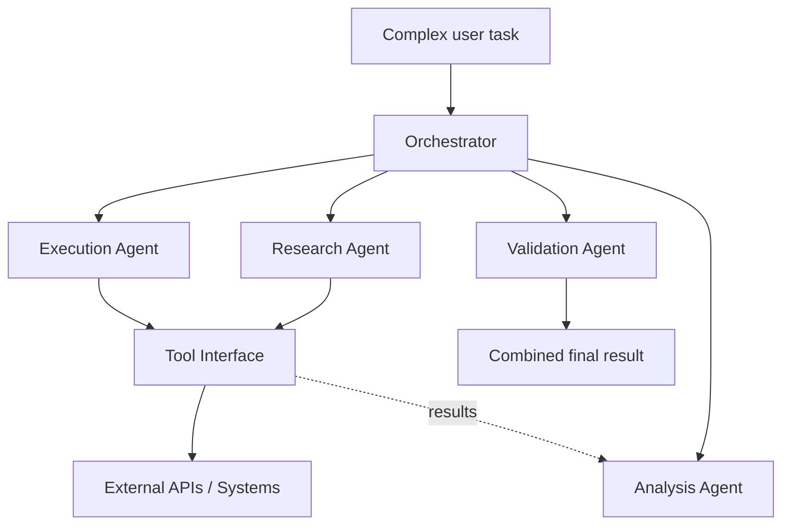
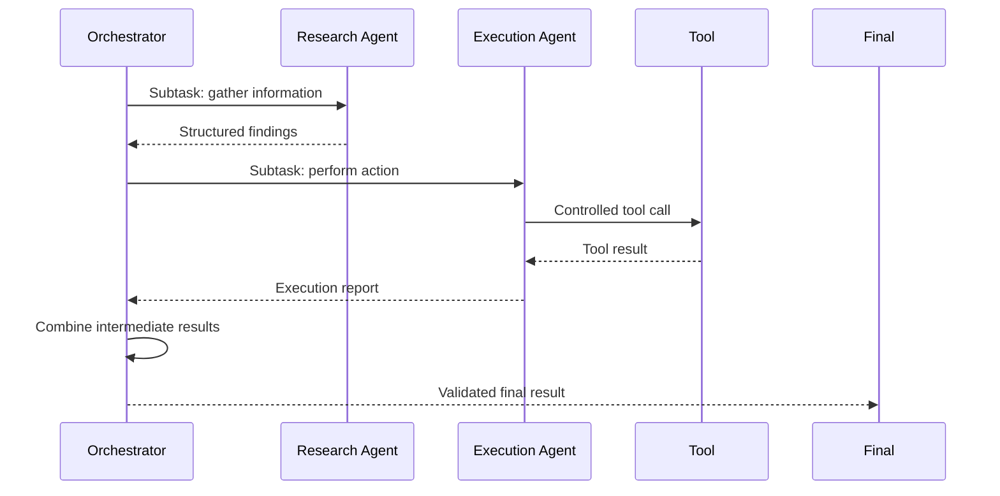

# Multi-Agent AI Assistant

**LLM-Based Multi-Agent System**

> **Repository Notice:** This repository contains architectural documentation only. The original implementation source code and private configuration are not publicly distributed.

## Overview

The Multi-Agent AI Assistant explores an architecture where multiple specialized AI agents collaborate to solve complex tasks.

Instead of asking one general-purpose LLM to perform every operation, the system distributes responsibilities across specialized agents with clearly defined roles.

## Objectives

- Decompose complex tasks.
- Assign subtasks to specialized agents.
- Give agents access to tools.
- Coordinate intermediate results.
- Combine specialized outputs into a final result.

## Architecture



## Orchestrator

The orchestrator acts as the coordination layer. It determines:

- Which agents are required.
- Which order they should execute in.
- What information each agent receives.
- How intermediate results are combined.

## Agent Specialization

| Agent | Responsibility |
|---|---|
| Research Agent | Collects and organizes information |
| Analysis Agent | Processes information and performs reasoning |
| Execution Agent | Interacts with external systems and APIs |
| Validation Agent | Checks results before they are returned |

## Tool Integration

Agents interact with external tools through controlled interfaces:

```text
Agent
  ↓
Tool Interface
  ↓
External API / System
  ↓
Result
  ↓
Agent
```

This separates reasoning from direct execution: an agent decides *what* to do, and the tool interface governs *how* it is executed.

## Agent Communication



## Design Principles

- Agent specialization
- Modular architecture
- Tool abstraction
- Explicit orchestration
- Structured communication
- Separation between reasoning and execution

## Technology Concepts

- LLMs
- Multi-agent systems
- Tool calling
- API orchestration
- Prompt engineering
- Agent memory
- Task decomposition

## Research Status and Limitations

This project is presented as an exploration of multi-agent architecture patterns. The documented design describes how responsibilities are divided and coordinated; it is not a claim of a production-grade autonomous system.

- Agent coordination can fail silently if intermediate results are malformed.
- Multi-agent chains increase latency and token cost relative to a single LLM call.
- The public repository does not include private source code or API credentials.
